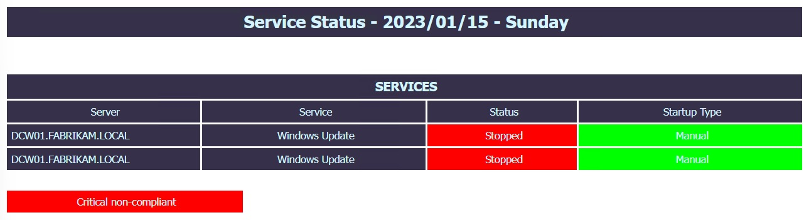

# pwsh-disk_utilization

# Requirements:
The server where this script executes must have access to the wmi of the remote server.

Typically, access rights and firewall rules (tcp135) is required.

# Sample output:
